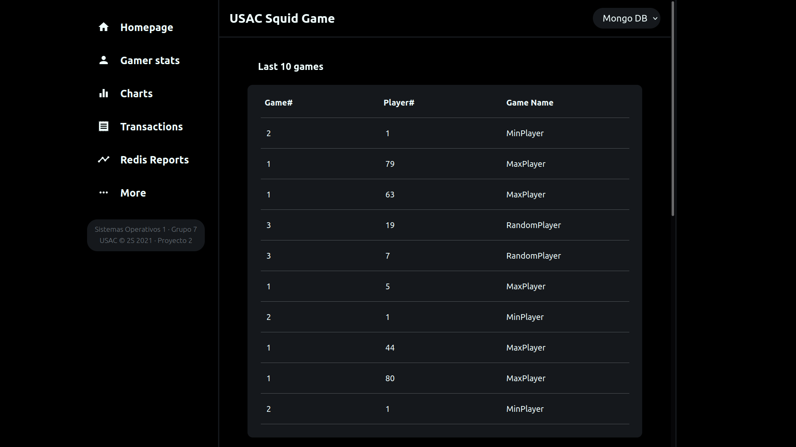
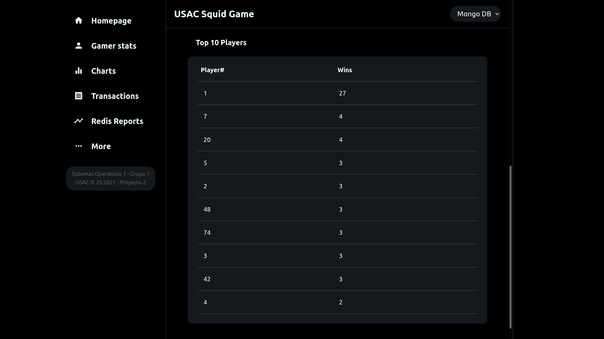
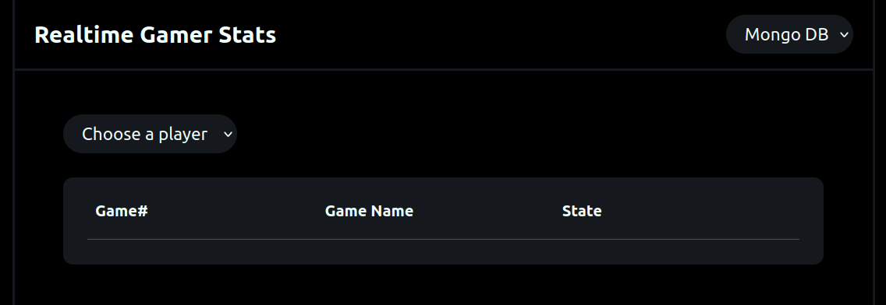
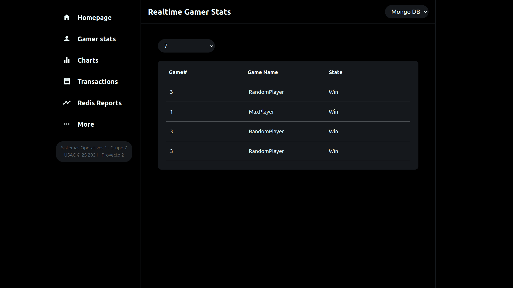
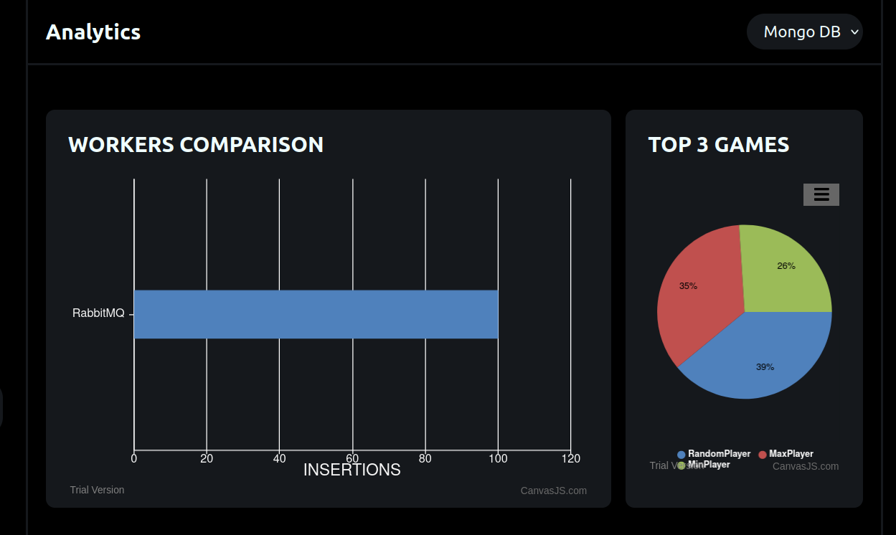
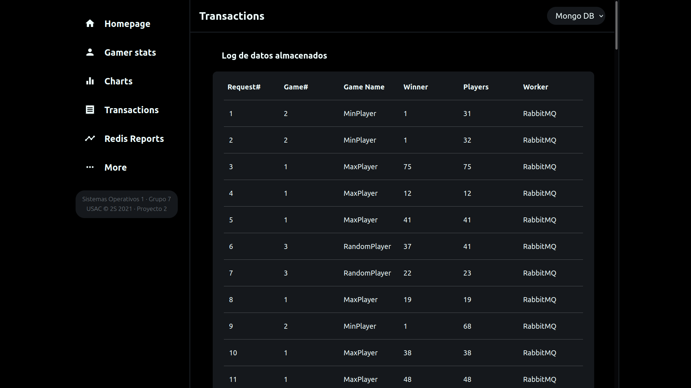
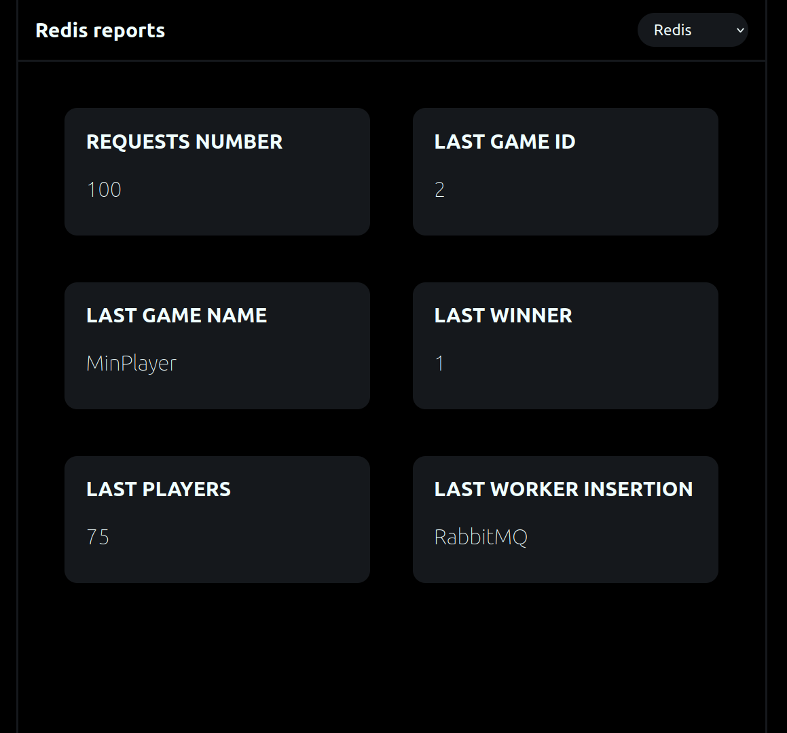

## Manual de usuario

<br/>

# Proyecto #2 - USAC SQUIDGAME

_Se solicita construir un sistema genérico de arquitectura distribuida que
muestre estadísticas en tiempo real utilizando Kubernetes y service mesh como
Linkerd y otras tecnologías Cloud Native. En la última parte se utilizará una
service mesh para dividir el tráfico. Adicionalmente, se añadirá Chaos Mesh
para implementar Chaos Engineering._

## Comenzando 🚀

_Estas instrucciones te permitirán obtener una copia del proyecto en funcionamiento en tu máquina local para propósitos de desarrollo y pruebas._

Mira **Deployment** para conocer como desplegar el proyecto.


### Pre-requisitos 📋

```
Un navegador web actualizado para visualizar los reportes y estadísticas en tiempo real. (Mozilla Firefox, Google Chrome, Microsoft Edge).
```

### Generador 🔧

Para poder utilizar el generador de tráfico para generar los juegos, es necesario el archivo compilado para su ejecución en un ordenador.

_Un ejemplo de comando válido:_

```
Usac Squid Game >> rungame --gamename "1 | MaxPlayer | 2 | MinPlayer | 3 | RandomPlayer" --players 85 --rungames 50 --concurrence 15 --timeout 0.15m
```

_Cuya posible salida sería_

```
Rungames finished!
50 requests has been sent.
```

<br>

## Despliegue 📦

_Para el uso correcto de la aplicación web se debe conocer cada funcionalidad._

## Construido con React

_Rutas disponibles:_

* **Homepage**

    Se encarga de mostrar los últimos 10 juegos realizados hasta el momento y el top 10 jugadores con mayor número de victorias.
    
    <div align="center">
    
    <hr>
    
    <hr>
    </div>

* **Gamer stats**

    Se encarga de mostrar en tiempo real las estadísticas de un jugador seleccionado de la lista de todos los jugadores que han ganado por lo menos una vez.
    Integra el ID del juego, el nombre del juego y su status de victoria.
    
    <div align="center">
    
    <hr>
    
    <hr>
    </div>

* **Charts**

    Son las gráficas en tiempo real de la comparación del número de inserciones que realizó cada worker a las bases de datos y el top 3 de los juegos más recurrentes con su porcentaje de representatividad.
    
    <div align="center">
    
    <hr>
    </div>

* **Transactions**

    Son todas las transacciones hechas a la colección de la base de datos de mongo, es de manera detallada cada uno de los registros de los juegos con su respectivo campo.
    
    <div align="center">
    
    <hr>
    </div>

* **Redis Reports**

    Se visualiza en tiempo real cada uno de los metadatos que son utilizados en la base de datos de Redis. Tales como la información del último juego realizado, el último jugador que ganó y la cantidad de peticiones que se han hecho y a qué worker que realizada la inserción.
    
    <div align="center">
    
    <hr>
    </div>

<br>

## Manual técnico 🖇️

Por favor lee el [manual técnico](https://github.com/ldecast/Proyecto2_SO1/blob/master/docs/ManualT%C3%A9cnico.pdf) para detalles de nuestro código, arquitectura y cada una de las tecnologías necesarias para la construcción del sistema del proyecto.

<br>

## Info 📖

Puedes encontrar mucho más de cómo funciona nuestro proyecto aquí: [Squid Game Usac](https://github.com/sergioarmgpl/operating-systems-usac-course/blob/master/lang/en/projects/project1v4/project1.md)

<br>

## Versionado 📌

Usamos Git para el versionado. Para todas las versiones disponibles, mira los [commits de este repositorio](https://github.com/ldecast/Proyecto2_SO1/commits/master).

<br>


## Autores ✒️

* **_Luis Danniel Castellanos - 201902238_** | [ldecast](https://github.com/ldecast)
* **_Benaventi Bernal Fuentes - 201021212_** | [benaventiDev](https://github.com/benaventiDev)

<br>

## Soporte técnico 🔧

```
luis.danniel@hotmail.com
```
<br>
---
⌨️ Sistemas Operativos 1 - Universidad de San Carlos de Guatemala - Segundo Semestre 2021

